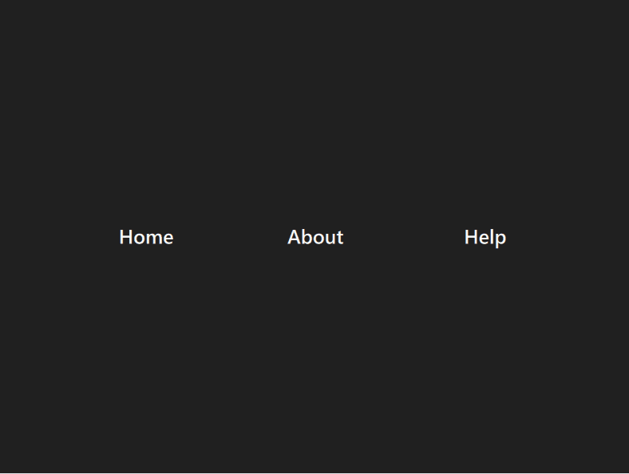

# QMLNavbarAnimation

A project made in order to continue working on animation and using the RectangleShadow in  order to add more effect on the created navbar, this makes really good buttons with very great effect easily.

## Result

